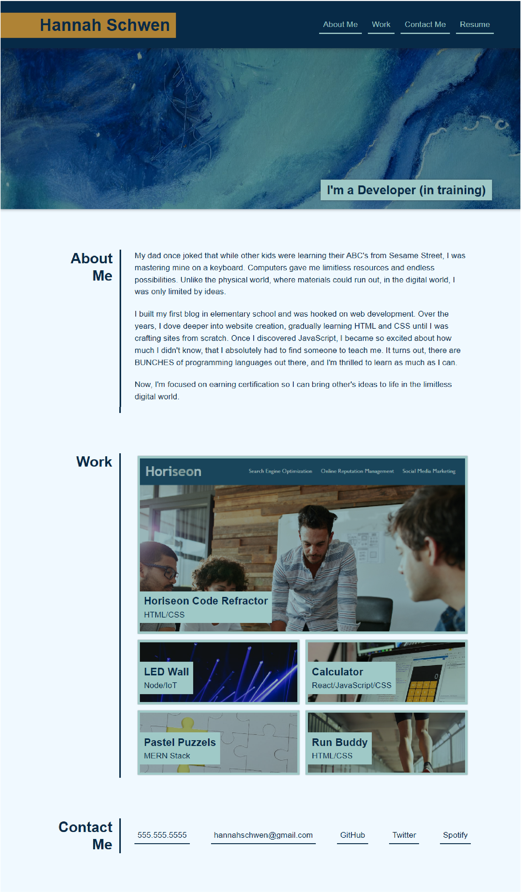

# Basic Portfolio

## Description

This project is a portfolio to show my work to potential employers. Since I don't have a lot of work to show yet, I have used stock photos and placeholder project names. The resume is also a placeholder file.

View the deployed application here: https://hannahschwen.github.io/basic-portfolio/

## Usage

Click the links at the top ('About Me', 'Work', 'Contact Me') to jump to that section of the page. Click 'Resume' to view a copy of my resume. The resume file is currently a placeholder.

The 'Work' section shows coding projects. Click anywhere on the image or label to view that project. Since I don't have a lot of work to show yet, the bottom four projects are placeholders.

The 'Contact Me' section contains a phone number, email, and links to GitHub, Twitter, and Spotify.

The following screenshot shows the web application:

The web application is responsive, and will adjust to different screen sizes.

## Credits

Photos in this application were obtained from Pexels.com and are royalty free.